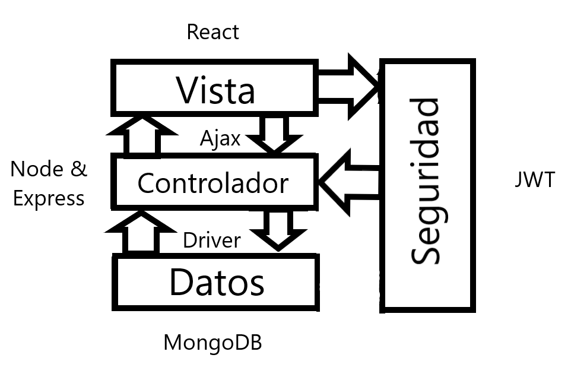
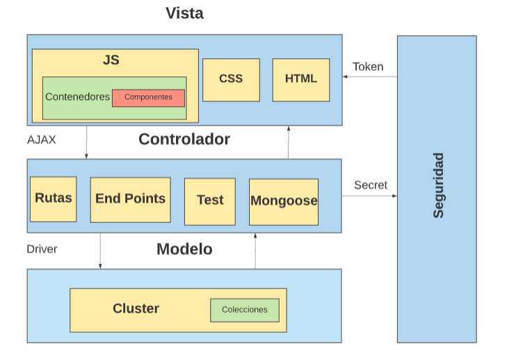
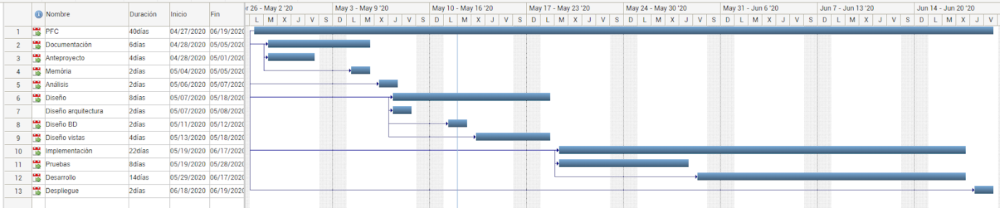
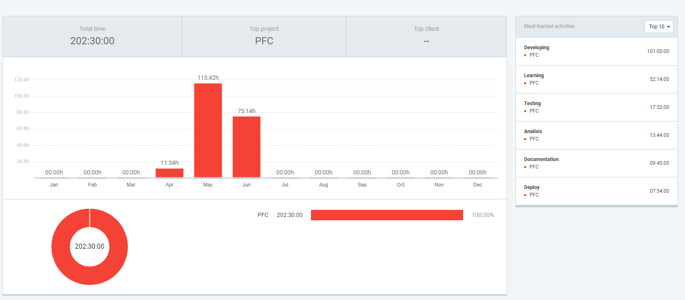

# PFC-Sprint-Organizer

### Motivación

  La idea del proyecto surge de la necesidad de tener un programa para gestionar proyectos, basado en el marco de trabajo SCRUM.De esta manera, se pueden gestionar mejor y fácil los recursos.Por ejemplo, en el caso de estar en un sprint podemos ver todas las tareas relacionadas al sprint , y todas los empleados relacionados.
  
  También, la idea era poder hacer que los empleados pudieran imputar de forma automática, pulsando start en la tarea y que esta empezara a contar,y al pulsar guardar directamente  guarde el tiempo imputado.Pero no lo he podido realizar al final.

### Objetivos
  
  1. Crear una aplicación web para gestionar equipos mediante el marco de trabajo SCRUM
  2. Crear una interfaz de usuario sencilla.
  3. Crear las herramientas necesarias para trabajar usando scrum (Creación de roles y esprints P.E)
  4. Gestión de proyectos
  5. Gestión de tareas
  6. Gestión de sprints
  7. Gestión de usuarios
  

### Descripción técnica

 1. El proyecto consiste en una aplicación web que se basará en el patrón de arquitectura de software Modelo-Vista-Controlador (MVC), estas tres capas, abstraen el modelo , la lógica de negocio y la vista. Usar este patrón de software nos beneficiará en que podremos reutilizar el código y tendremos las  capas separadas como se ha indicado anteriormente, esto nos va a facilitar tanto el desarrollo como el mantenimiento.

   - La vista o la capa de presentación tiene como objetivo representar el modelo al usuario de tal forma que este pueda interactuar con él (realizando llamadas al controlador).

      - Para esta capa vamos a usar React JS, puesto que es una de las librerías más usadas actualmente, cosa que hace que sea más fácil desarrollar debido a que nos permitirá encontrar más información sobre posibles problemas que podamos localizar. Además,  tiene muchos componentes que se pueden reusar de otros proyectos. 

        Para manejar el flujo de los datos vamos a emplear Redux,   ya que este nos permitirá tener un mejor manejo del estado de la aplicación, será mucho más fácil de debuguear y se integra a la perfección  con React.

  - El controlador o capa de negocio es la encargada de responder a los eventos que normalmente se envÍan desde la capa de presentación, a partir de estos eventos invoca las peticiones al modelo, ya sea para crear un nuevo registro o editar el mismo.En resumen, es el intermediario entre el modelo y la vista.

    - Para esta capa vamos a usar NodeJS, usaremos este entorno con su framework Express en la capa de servidor por varias razones: para empezar, solo tiene un único hilo de ejecución, cosa que hace no tenga problemas de sincronía entre hilos como otros lenguajes como JAVA podrían tener.También tiene mucha facilidad a la hora de crear una aplicación escalable como la nuestra.Otra ventaja, es que usaremos el mismo lenguaje que en la capa de presentación, así no tendremos problemas a la hora de pasar de uno a otro.La arquitectura que usaremos es la dirigida a eventos, puesto que es la más habitual cuando se usa NodeJs  y aparte, hará nuestra aplicación más fácil de mantener y extender. 

  - El modelo o capa de datos es la representación de la información sobre la cual la aplicación opera.También se encarga de crear,actualiza, leer y eliminar la información. Se encarga también de habilitar la información que luego se mostrará en la vista.

    - Para esta capa usaremos MongoDB, puesto que también se basa en JS con lo cual será mucho más fácil de trabajar, es una base de datos muy flexible ya que se puede usar con un modelo relacional o de forma totalmente diferente a este. Por otra lado, ofrece el producto Atlas, que nos permite tener un servidor en la nube, cosa que para la fase de producción del proyecto nos irá estupendamente.

    En definitiva, podemos afirmar que usaremos el MERN stack, con el cual usamos JavaScript en toda la aplicación, aparte es una combinación muy usada con la cual muchos de los problemas que podamos encontrar estarán resueltos,por lo tanto la comunicación entre las capas será más simple de realizar. 

    Aquí podemos ver en forma de esquema como va a funcionar nuestra arquitectura de 3 capas.
    
     
      <small>fig 1.</small>
    
    
  2. Diagrama de componentes:

 
          <small>fig 2.</small>

### Metodología de desarrollo

- El proyecto se realizará mediante el modelo basado en prototipos. Un prototipo es una versión preliminar de un sistema con fines de  demostración o evaluación de ciertos requisitos. La idea es hacer comprender las especificaciones del producto final.
El prototipo puede ser una parte final de la aplicación o ser desechado.

    - Las fases son las siguientes:

        1. Identificación de los requisitos que debe cumplir el prototipo.
        2. Diseñar e implementar el prototipo.
        3. Utilizar el prototipo con el fin de probar que cumple con los requisitos para los que fue diseñado

  - TDD: Test Driven Development, es una práctica que consta de otras dos. La primera se basa en escribir las pruebas al inicio, y la segunda es la refactorización. Primero se escribe la prueba, luego el código hasta que se verifique que se cumple, y luego se refactoriza el código.La idea es tener un código limpio y que funcione.
  
  - Panel Kanban: El tablero Kanban es la herramienta para mapear y visualizar su flujo de trabajo y uno de los componentes claves del método Kanban. Se divide en filas y  columnas.Las columnas visualizan una fase de su proceso y las filas representan diferentes tipos de actividades específicas (diseño, errores, deuda técnica, etc.).
 
 
 - Git: La forma de trabajar en git es, crear un issue en git, luego en la rama de develop crear la rama correspondiente para 
 hacer o arreglar el fix.Hacer merge con Develop, y luego en master hacer pr desde develop.

### Diagrama de Gantt

Antes: 
  
      <small>fig 3.</small>
      

Despues: 

      <small>fig 4.</small>

Análisis de las diferencias de tiempo:
  
  - El desfase en las horas de desarrollo y totales:
      Al usar unas tecnologías que no conocía he tenido que dedicar muchas horas a aprender como funcionan, y estas han repercutido
      en las horas de desarrollo, también he dedicado menos horas y por lo tanto, no he podido realizar todo lo previsto en ese tiempo.
      
  - Testing:
    En testing he dedicado menos horas de las planeadas porque pensaba hacer tests del frontend también, pero finalmente no lo he 
    realizado.A parte, así como he realizado el código me ha permitido que los tests sean más fáciles de reutilizar, por lo tanto, 
    también ha hecho que tenga que dedicar menos tiempo a ello.

### Clockify

      <small>fig 5.</small>

### Presupuesto

  Para los ides, y el lenguaje no hay que incluir ningún precio, porque estos són gratuitos tanto para produción como desarrollo.
  
  - Costes mensuales:
    1. Atlas: En caso que la aplicación creciera, habría que pagar la licencia de  "dedicated Clusters" por unos 50,74 € al mes.
    2. Heroku: Para el uso de producción habría que pasar al modelo hobby, que cuesta 6,23€ al mes.
    
    
     <strong> Total: 56,97 € * mes </strong>
   
  - Coste desarrollo:
    
    1. Horas de análisis 15€ * 14h = 60 €
    2. Horas de testing 8€ * 18h = 144 €
    3. Horas de documentación 5€ * 10h = 50 €
    4. Horas de desarrollo 8€ * 101h = 808 €
    5. Horas de despliegue 8€ * 8h  = 64 €
    
    
    <strong> Total: 1.126€ </strong>

### Conclusiones

  - Posibles Mejoras:
      
      1. Mejorar las relaciones de las bases de datos, dado que, ahora mismo no borra en cascada.
      2. Mejorar las relaciones en si, en el código las relaciones no se respetan como tal.
      3. Añadir la función para resetear la contraseña.
      4. Añadir la funcionalidad de imputar automáticamente.
      5. Añadir las restricciones
      
  - Principales dificultades encontradas:
      1. Las llamadas desde el front, puesto que he teniod problemas con el CORS y con el proxy.
      2. Mantener el control sobre el estado de la aplicación
